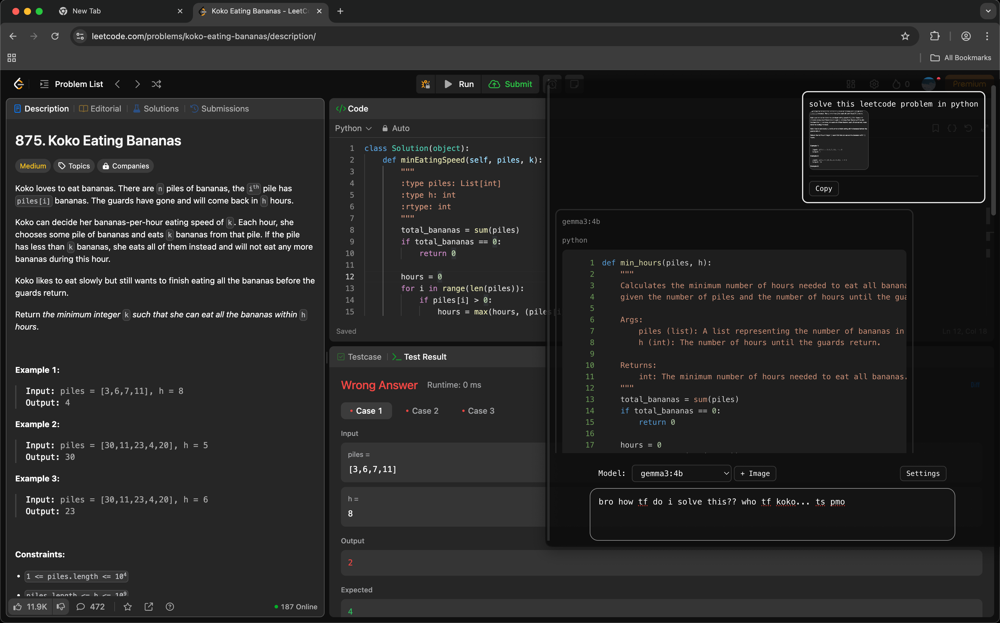

# anywhere
Using LLMs from anywhere via an overlay.

mostly POC, currently only supporting ollama


## ✨ Features
- Transluscent, toggleable overlay with Command/Control+D
- Use any local LLM with ollama
- Switch between chats
- 5 different themes
- Fully featured LLM chat with syntax highlighting, copying, formatting

## 🛠️ Technologies
- Electron and Vite (electron-vite)
- TypeScript
- React + Jotai

## ⌨️ Shortcuts
- Toggle Overlay: Command/Control+D

## 📥 Installation
```bash
git clone https://github.com/tokaa1/anywhere.git
cd anywhere

npm install

npm run dev
```

